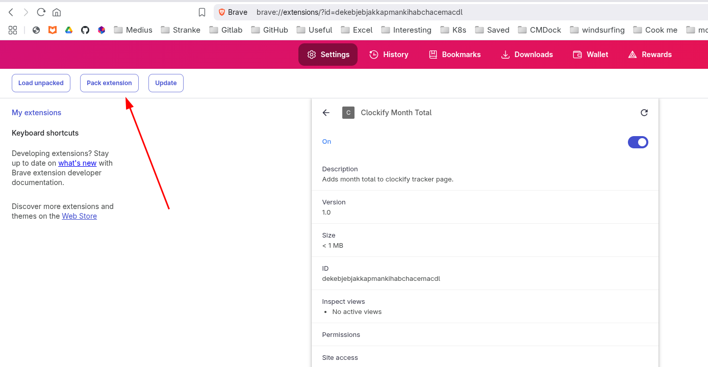

### Create a .crx Package (Distribution)
1. **Pack the Extension:**
    - In Chrome extensions page (`chrome://extensions/`)
    - Enable "Developer mode"
    - Click "Pack extension"
    - Browse to your extension's root directory
    - Leave "Private key file" empty for first-time packaging
    - Click "Pack Extension"
    

2. **Result:**
    - Chrome will create two files:
        - `your-extension.crx` (the packaged extension)
        - `your-extension.pem` (private key - keep this safe!)

