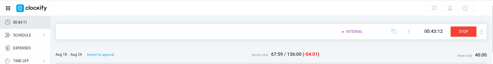

# Month Total Clockify Extension

A Chrome extension that adds monthly time totals to your Clockify time tracking interface, making it easier to monitor your monthly progress at a glance.



## Features

- 📊 **Monthly Totals**: Automatically calculates and displays your total tracked time for the current month
- 🎯 **Easy Integration**: Seamlessly integrates with the existing Clockify web interface
- ⚡ **Real-time Updates**: Updates totals as you track time throughout the day
- 🎨 **Clean UI**: Minimal, non-intrusive design that fits naturally with Clockify's interface

## Installation

### Download from GitHub Releases

1. Go to the [Releases](../../releases) page
2. Download the latest `chrome-extension-vX.X.X.zip` file
3. Extract the ZIP file to a folder on your computer

### Load Extension in Chrome

1. Open Chrome and navigate to `chrome://extensions/`
2. Enable **Developer mode** (toggle in the top right corner)
3. Click **Load unpacked**
4. Select the extracted folder containing the extension files
5. The extension should now appear in your extensions list and be ready to use

### Using the Extension

1. Navigate to [Clockify](https://app.clockify.me/) in your Chrome browser
2. The extension will automatically integrate with the Clockify interface
3. You'll see monthly totals displayed alongside your time tracking data

## Development

### Project Structure

month-total-clockify-extension \
   ├── manifest.json # Extension configuration \
   ├── icon.png # Extension icon \
   ├── script.js # Main functionality \
   └── README.md # This file

### Local Development

1. Clone this repository:
   ```bash
   git clone https://github.com/your-username/month-total-clockify-extension.git
   cd month-total-clockify-extension
   ```

2. Load the extension in Chrome (see Installation steps above)

3. Make your changes to the code

4. Reload the extension in `chrome://extensions/` to test changes

### Building for Distribution

The project uses GitHub Actions for automated releases. When you push a version tag:

```bash
git tag v1.0.0
git push origin v1.0.0
```
